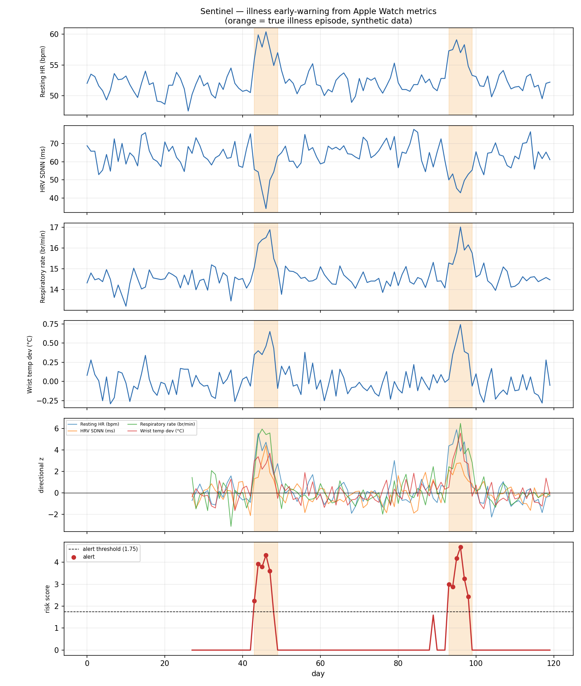

# Sentinel

Personalised illness early-warning from Apple Watch data. Learns your own
physiological baseline and flags mornings when several signals drift together
in the direction that illness moves them.

An iOS app pulls daily metrics out of HealthKit; a Python pipeline builds the
baseline, scores each day, and evaluates detections against known illness dates.

```
                                                                
  Apple Watch ──▶ HealthKit ──▶ Sentinel.app ──▶ JSON export     
                                                    │            
                                                    ▼            
              alerts ◀── risk score ◀── robust z ◀── daily metrics
```

## Status

The detector is **validated on synthetic data only**. See [Limitations](#limitations).

| | |
|---|---|
| Pipeline | working, 14 tests passing |
| iOS app | compiles and links; not yet run on a device |
| Real-world validation | **none yet** |

## The signals

Four metrics, each with a known direction of travel during the illness prodrome:

| Metric | Moves | Why |
|---|---|---|
| Resting heart rate | up | sympathetic drive, raised metabolic demand |
| HRV (SDNN) | down | parasympathetic withdrawal under immune stress |
| Respiratory rate | up | measured during sleep, so movement doesn't confound it |
| Wrist temperature | up | Apple's own sleeping-wrist-temperature deviation |

## How it works

**1. A personal baseline, not a population one.** A resting heart rate of 52
means nothing in isolation. Each metric is compared against *your* trailing
28-day median.

**2. The baseline never sees the future.** The rolling window is shifted by one
day, so day *t* is scored only against days that had already happened. This is
the whole reason the reported lead times mean anything: a centred window would
let tomorrow's data inform today's alert and inflate every result. Two tests
pin this down, and they fail if the shift is removed.

**3. Median and MAD, not mean and standard deviation.** Illness days are exactly
the outliers that would corrupt a mean-based baseline, so a naive detector
gradually learns your illnesses as normal and goes quiet. Robust statistics
prevent that; `test_baseline_survives_a_previous_illness` guards it.

**4. Three of four metrics must agree.** Any single signal moves for dull
reasons: a warm room, a late night, alcohol, a hard session. What is hard to
fake is four signals drifting the same way at once. A lone elevated metric
scores exactly zero.

## Results (synthetic)

120 simulated days containing two illness episodes:

```
illness at day 45: DETECTED, lead time +2 days
illness at day 95: DETECTED, lead time +2 days
false alarms on healthy days: 0
```



**That +2 days is not a performance claim.** The simulator injects the drift two
days before onset, so detecting it two days early only shows the pipeline is
wired correctly and cannot see ahead. Published wearable studies report roughly
one to three days of lead with materially more false alarms.

## Run it

```bash
python3 pipeline/make_synthetic.py   # generate the dataset
python3 pipeline/sentinel.py         # detect and evaluate
python3 pipeline/tune.py             # sweep the gate and threshold
python3 pipeline/plot.py             # write the timeline figure
python3 -m pytest tests -q           # 14 tests
```

Requires `numpy`, `pandas`, `matplotlib`, `pytest`.

## Using your own data

Build the iOS app (see [ios/README.md](ios/README.md)), export from your iPhone,
drop the JSON in `pipeline/data/`, and point `load()` at it. Then **re-run
`tune.py`**. The shipped constants were fitted to two synthetic events and
should not be trusted on real data.

## Limitations

- **Never tested on a human.** Every number here comes from simulated data.
- **Tuned on two events**, which is far too few for the thresholds to mean much.
- **Single subject by design.** Even fully deployed this is n=1 with
  self-reported onset dates and no control.
- **Detects deviation, not diagnosis.** It cannot distinguish infection from
  overtraining, a hangover, or a hot bedroom. Anything that stresses the body
  looks similar through four numbers.
- **Needs ~4 weeks of history** before it will score anything at all.
- **Not a medical device.**

## Layout

```
pipeline/   detector, tuner, plotting, synthetic data generator
tests/      14 tests, including two that prove the detector cannot see ahead
ios/        SwiftUI + HealthKit exporter and its Xcode project
```
